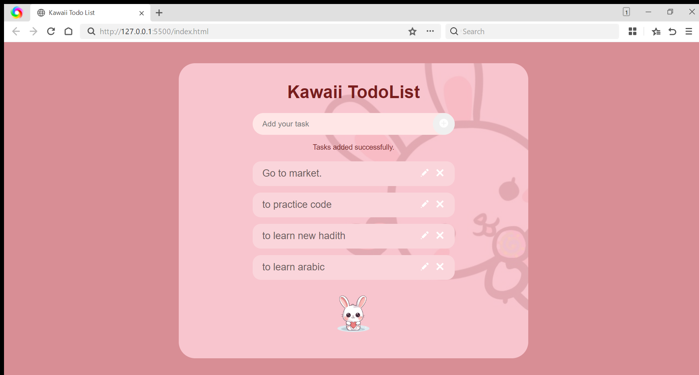

# 🌸 Kawaii Todo List

## 📖 Project Description

The Kawaii Todo List is a simple and cute task management web application built using HTML and CSS. The goal of the project was to recreate a Figma design as closely as possible while keeping the code clean, readable, and beginner-friendly. The interface features a soft pink color palette, rounded task cards, a bunny-themed background, and a mascot to create a fun and aesthetically pleasing user experience.

This project helped me practice HTML page structure, CSS layout techniques, Flexbox, positioning, responsive design with media queries, and styling elements to match a design reference. Although the current version is a static UI, it is designed to be ready for JavaScript functionality in the future.

---

## 🛠 Technologies Used

- HTML5
- CSS3
- Flexbox
- Media Queries (Responsive Design)

---

## ✨ Features

- Cute kawaii-inspired design
- Responsive layout for desktop and mobile
- Rounded input field with add button
- Styled task cards
- Bunny-themed background and mascot
- Clean and beginner-friendly CSS structure

---

## 📷 Screenshots

### Desktop Version

> Insert your desktop screenshot here.

Example:

```md

```

### Mobile Version

<p float="left">
  
</p>

## 💡 Challenges and Learning

### What was easy

Creating the HTML structure and organizing the different sections of the todo list was straightforward. Using Flexbox to align the input field, buttons, and task items also became easier with practice.

### What was difficult

The most challenging part was recreating the Figma design as accurately as possible. Positioning and resizing the faded bunny background while keeping the layout responsive required several adjustments. Making the design work well on both desktop and mobile screens also took multiple iterations, especially when positioning the background image and resizing the task cards.

### How I approached the task

I started by building the HTML structure first before adding CSS styles section by section. After getting the desktop layout close to the Figma design, I focused on refining spacing, colors, and positioning. Finally, I added media queries to improve the mobile experience and tested different values until the layout looked balanced across screen sizes.

---

## 🚀 Future Improvements

- Add JavaScript functionality to create tasks dynamically.
- Implement edit and delete features.
- Save tasks using Local Storage.
- Add task completion with checkboxes.
- Include animations and hover effects.
